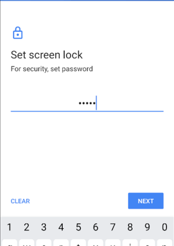
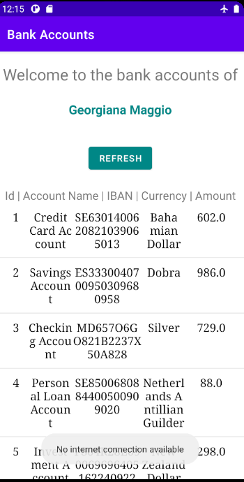

# Secure Development : Mobile Application to see bank accounts
##### **Julie ANDRE IOS1**

This mobile application has been made with Android Studio IDE in Java.
The goal is to create a secure mobile application to see bank accounts.

### 1. Explain how you ensure user is the right one starting the app

To ensure that the user is the right one, he has to go through 2 security checks:

* First, when the app is started, a screen is displayed asking for him to
confirm he is the rightful user of the application by providing the right
authentication. The authentication screen depends on the user's phone settings (pin code, password or pattern). A strong password can actually be more robust than Digital print authentication, and a lot of mobile device still do not have digital captors.

If no screen lock settings were find, the app asks the user to define one and don't grant him access to the accounts while the settings have not been adapted.

Note: I could have added a timer to avoid brute force attempts of authentication but if the user has defined a strong pattern or password, the security should not be compromised.

>Screen Lock Settings panel is displayed

Here we set a password for authentication for instance:

>Setting a password as screen lock

While the user authentication has not been validated (wrong password for instance or the user clicked on the return button), the user can't have access to the accounts. The **Continue** button is disabled for him.
If the user needs to authenticate again (if he clicked on the return button for instance), he can click on the **Authenticate** button.

>Wrong authentication

If the user closes the authentication panel without being authenticated properly, he will have to click on the **Authenticate** button to try to authenticate again. The **Continue** button is not enabled until the authentication is completed.

> Authentication failed message, the Continue button is disabled

* Then, once the user has correctly authenticate, he can now access his accounts by providing his ID.

> Authentication succeeded, the user can now enter an ID and try to login

  - *Online Mode*:
  If the ID is invalid or does not exist in the config part of the API, a    message is displayed meaning the user was not allowed to access the
  accounts. Otherwise the access is granted and the user's details and
  accounts information are displayed.

  - *Offline Mode*:
  In the case where no internet connection is available, the application
  can't access the API. So, the files stored internally in the app are used   to verify the user's ID and display its accounts. But for these files to   exist, the user must have logged previously to the app with an internet    connection available. To verify the user ID, the last ID the user logged   with is stored in the internal files.

> Invalid ID, the access tot he accounts is not granted to the user

  

> The ID is valid, the user details and his accounts are displayed.
The user can scroll down the list to see all his accounts.

### 2. How do you securely saves user's data on the phone?

The data are saved on the phone into the app's **Internal Storage** making these files accessible only by our app.
There are two files:

  - *user.txt* containing the details (ID, name, lastname) with which user
  logged with the last time while having an internet connection.
  - *accountsJson.txt* containing the information of the user's accounts

These files are encrypted using Advanced Encryption Standard (AES) 256-bits keys. For that, the application uses subkeys managed by a **MasterKey** provided by Android's crypto dependency (Jetpack Security). This Masterkey is stored in the Android Keystore System (making it more difficult to extract from the device) whereas the subkeys are encrypted and stored in the shared preferences.

> We can see that the Internal Files stored in the application data folder
are indeed encrypted

### 3. How did you hide the API url?

The exchanges with the API are secured over a TLS connection provided by the OkHttp library. So, the API URL is hidden during network connection.

> If the url is not using https, the connection is refused

In order to hide the API url in the apk file, we can obfuscate it. Indeed, hackers can decompile the apk file and easily find the API url if it is not encrypted. To avoid reverse engineering, this application is using **Proguard** to produce a bytecode harder to decrypt for a potential Hacker who managed to decompile the apk file. It will also obfuscate the variable and function names, making the code harder to understand if it is decompiled.

Proguard has several benefits:

- Code shrinking
- Resource shrinking
- Obfuscation
- Optimization

But even Proguard is not sufficient enough to hide sensible data. It will just slow down the process for the Hacker but an experienced one can still retrieve it. 

To make it harder to retrieve sensible data from the apk file decompilation, we can use code Encryption. This can be done thanks to **Enigma** who encrypts all String values of the application code at compilation time.

Enigma has these benefits:

- Code parsing and encryption of all String values for each Java file
- Injection of fake secret keys, the real secret keys will be stored amoung the fake ones and it will be much more harder for someone to find them

### 4. More Screenshots of the application

> If no lock settings has been configured previously, the app makes the user define one. Here the user choses a Pattern.

> Authentication with a pattern when the app is started

> Authentication with a PIN Code when the app is started

> Accounts viewer, if the user wants to go back to the Login page he can simply click on the return button of his mobile.

If the user closes the app, he will be disconnected and asked to authenticate again. Each time the it is started, the application requires an authentication.

> Refreshing the accounts if the internet connection is up

> Trying to refresh the accounts if the internet connection is unavailable. A toast message is displayed saying the refresh is not possible since no connection is available.